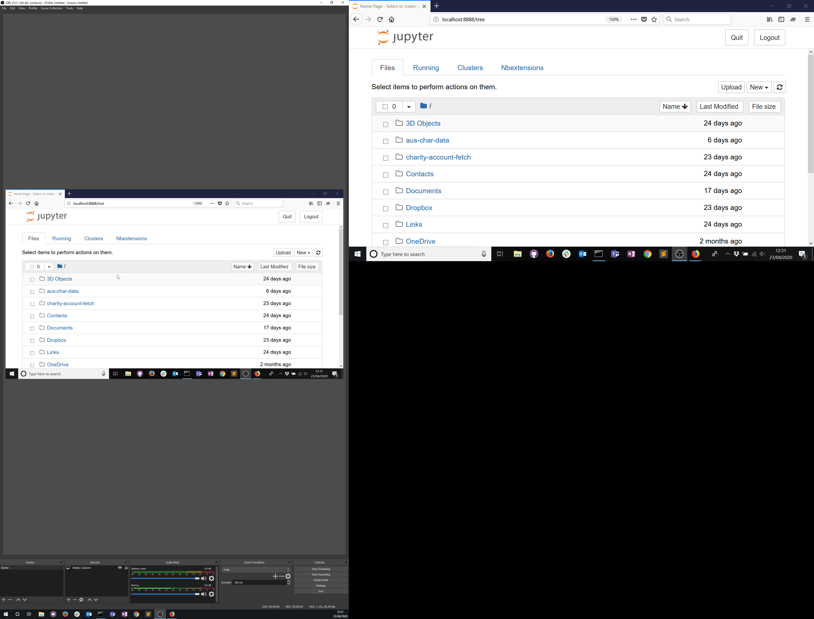

# Installing Python

These instructions guide you through the process of installing Python and other packages (e.g., Jupyter Notebook) on your machine. There are also instructions for creating a computing environment that enables you to run the web-scraping code associated with the *Web-scraping for Social Science Research* training series.

### Install Python

The easiest means of installing Python is to download the free Anaconda distribution of the programming language:
* <a href="https://www.anaconda.com/distribution/#windows" target=_blank>Windows download</a>
* <a href="https://www.anaconda.com/distribution/#linux" target=_blank>Linux download</a>
* <a href="https://www.anaconda.com/distribution/#macos" target=_blank>Mac download</a>

Follow the guidance provided by Anaconda or <a href="https://www.youtube.com/watch?1=&v=a-a79gH6fB8" target=_blank>watch this video guide</a> by King's College London (note: refers to Windows installation).

### Running Python

Anaconda provides various ways of running Python on your machine. We prefer using <a href="https://jupyter.org/" target=_blank>Jupyter Notebook</a> for writing and documenting our code.
To launch Jupyter notebook, open your Command Line Interface (CLI) and type the following:
```
jupyter notebook
```

For example, to launch Jupyter Notebook on a Windows machine:


After a short loading period you will see a screen similar to this:
